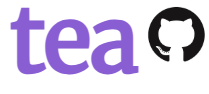

## Home

Welcome to Tea - the automated statistical analysis tool! Whether you are a experienced statistitian looking to optimize your workflow, or a software engineer hoping to run some easy analysis tests, Tea is built for you! 

This guide walks through each step of setting up and using Tea and provides ample detail and examples. After reading, users can jump into their own projects confident in their abilities to use Tea to it's fullest potential. 

[Download Tea](https://tea-lang.org/)
