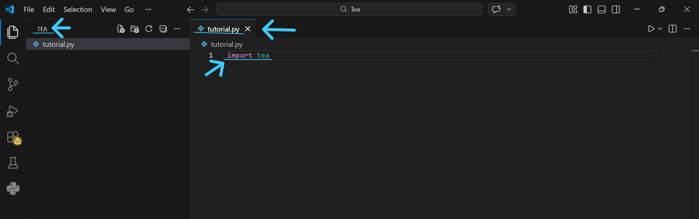
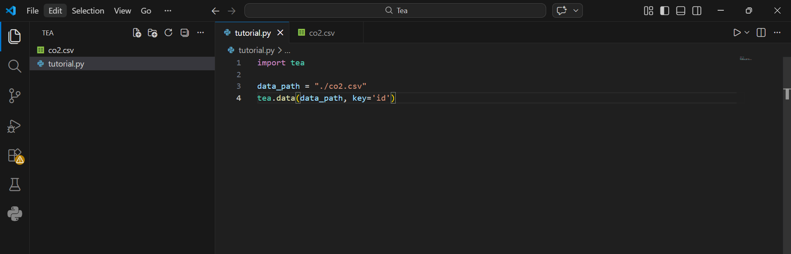
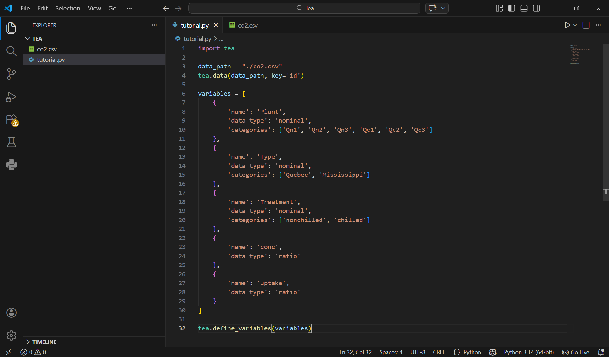
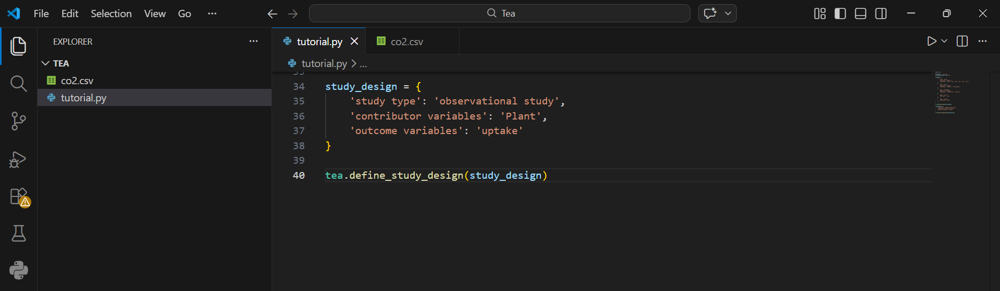
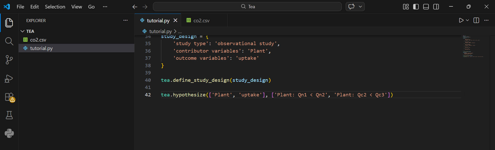
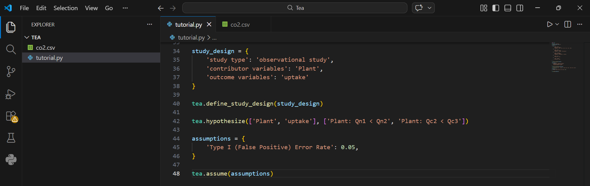
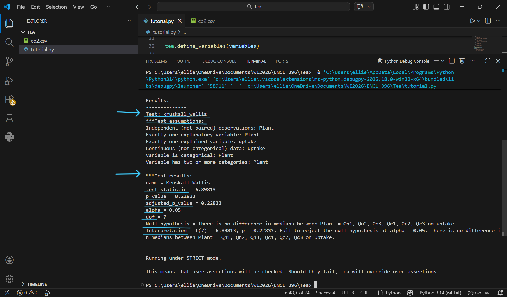

# Using Tea

This document is for an audience with a minimal amount of experience with programming and statistical analysis who want to set up and use Tea for automatic statistical analysis for their datasets. This document guides readers through installing and loading datasets into Tea, then it teaches readers how to define variables, write hypotheses, add assumptions, run tests, and interpret the results of Tea’s statistical tests.

Example Data File - [co2.csv](https://github.com/ekraw36/Tea_Docs/blob/main/co2.csv)<br>
Example Tea File - [tutorial.py](https://github.com/emjun/tea-lang-vis/blob/master/examples/Co2/co2_tea.py)

## Setting up Tea
### 1. Install Python
Tea works within the programming language Python. Before downloading and installing Tea, make sure Python 3.6 or higher is installed on your machine. [Learn more about installing Python here.](https://www.python.org/downloads/)

### 2. Install Tea
Before you can use Tea, we first have to install it onto your computer.
- Open a terminal or command prompt.
  
- Type `pip install tealang` and hit enter. A long list of messages appear while installing tea. This process can take a few minutes, so be patient!
  
- Once Tea is successfully installed, the cursor will reappear and you will regain the ability to type commands.

*Note: If you get a red error message `The term ‘pip’ is not recognized as the name of a cmdlet...` when trying to install Tea, try typing `py -m pip install tealang` instead.*

### 3. Create a Tea File
Now that Tea is installed, you can import it into any Python file to use it.
- Create a new Python file with any Integrated Developer Environment (IDE). I recommend [VS Code](https://code.visualstudio.com/) for beginners.
  
- Type `import tea` into the first line of the file.
  
- Save the file pressing the ***Ctrl + S*** keys simultaneously or by pressing the ***Save*** button in your IDE.


> "tutorial.py" imports Tea and is in the folder "Tea". 

## Defining Data & Specifications

### 1. Load a dataset into Tea
Tea performs statistical analysis on data you provide. Tea accepts data as either a [CSV file](https://en.wikipedia.org/wiki/Comma-separated_values) or a [Pandas DataFrame](https://www.w3schools.com/python/pandas/pandas_dataframes.asp). If the data is a Pandas DataFrame, Tea expects it to be in long format.

- Place your data file into the same folder as your Python Tea file. [(Example file - how much CO2 different plants absorb when exposed to different CO2 concentrations)](co2.csv)
  
- Add the lines of code below into your Python file to load your dataset into Tea.
> ```
> data_path = "./<YOUR DATA FILE>"
> tea.data(data_path)
> ```

- Compile and run the Python file. If it runs with no errors, the dataset has been successfully loaded. 

-  **If participants appear multiple times:** specify a key column with `tea.data(data_path, key='<KEY COLUMN>')`. Without a key, each row in the dataset is treated as an individual data point.
 
*Note: If your specify a key column but the key column doesn’t actually exist in your dataset, Tea raises an error when running the program.*


>"co2.csv" has been added to the "Tea" folder, and "tutorial.py" imports it's data to Tea. It also uses a key column labelled "id".

### 2. Define Variables
Each column in the dataset corresponds to a different variable. For each variable you plan to analyze, Tea requires you to define it with a name, data type, and (if needed) a category or range. Tea uses these definitions to understand what kind of data you are working with and to determine which statistical tests are appropriate.<br>

Tea supports four [data types](https://ekraw36.github.io/Tea_Docs/#/glossary?id=variables):
  1. **nominal**: qualitative unordered categories (e.g., “chilled”, “nonchilled”)
  2. **ordinal**: numerical ordered categories (e.g., 1 < 2 < 3 < 4 < 5)
  3. **interval**: numeric values without a meaningful zero
  4. **ratio**: numeric values with a meaningful zero

*Note: Most numeric scientific measurements (like CO₂ concentration or uptake) are ratio‑type variables.* 

- Identify the variables you want Tea to analyze. 
   
- Create a list of variable definitions in your Python file.
> ```
> variables = [
>   {
>     'name': '<VARIABLE1 NAME>'
>     'data type': '<VARIABLE1 TYPE>' // nominal, ordinal, interval, or ratio
> 
>     // for data types nominal or ordinal
>     'categories': '[<CATEGORY1 NAME>, <CATEGORY2 NAME>, <CATEGORY3 NAME>, ...]'
>
>     // for data types interal or ratio
>     'range': '[<MIN VALUE>, <MAX VALUE>]'
>   }
> ]
> ```

- Add `tea.define_variables(variables)` after the variable definitions to pass them to Tea.
  

> - "Plants": 2 different species *('Qn' v. 'Qc)* of plants are used, 3 of each type.
> - "Type": Half of the plants are from Mississippi, and the other half from Quebec.
> - "Treatment": Half of the plants were tested in a chilled environment, and the other half were tested in a room temperature environment.
> - "conc": The concentration of Co2 each plant was subjected to.
> - "uptake": The amount of Co2 each plant absorbed.

### 3. Define Study Design
After defining your variables, you must tell Tea how they relate to each other. This is called the [study design](https://ekraw36.github.io/Tea_Docs/#/glossary?id=study-designs). Tea needs to know which variables are independent/contributors, which are dependent/outcomes, and whether your dataset comes from an experiment or an observational study. You must assign atleast one variable for each type, but you can also assign multiple.

- Decide whether your dataset represents an experiment or an observational study. 
  
- Create a study design dictionary in your Python file:
  > ```
  > study_design = {
  >   'study_type': '<STUDY TYPE>' // 'experiment' or 'observational study'
  > 
  >   // if study type is an experiment
  >   'independent variables': ['<VARIABLE1 NAME>', '<VARIABLE2 NAME>', ...]
  >   'dependent variables': '[<VARIABLE1 NAME>', '<VARIABLE2 NAME>', ...]
  > 
  >   // if study type is an observational study
  >   'contributor variables': ['<VARIABLE1 NAME>', '<VARIABLE2 NAME>', ...']
  >   'outcome variables': ['<VARIABLE1 NAME>', '<VARIABLE2 NAME>', ...]
  > }
  > ```

- Add `define_study_design(study_design)` to pass the study design to Tea.
  

> - In this example, we are seeing if different plants of the same type absorb different amounts of Co2. It is an observational study because nothing is being controlled by the researchers. 

### 4. Define Hypotheses
A [hypothesis](https://ekraw36.github.io/Tea_Docs/#/glossary?id=hypotheses) tells Tea what relationship you want to test. Tea supports several types of hypotheses, including one‑sided comparisons, two‑sided comparisons, partial orders, and linear relationships. [(Learn more about hypothesis testing here)](https://resources.nu.edu/statsresources/hypothesistesting)

- Identify the variables involved in your hypotheses. Atleast one hypothesis is required, but you can also define multiple and Tea will run a test for each one.
  
- Write your hypotheses and the involved variables in Tea:
  > ```
  > // one sided comparisons: VARIABLE1 has categories CAT1 and CAT2.
  > // This hypothesis describes a higher rate of VARIABLE2 in CAT1 than in CAT2. 
  > results1 = tea.hypothesize(['<VARIABLE1>', '<VARIABLE2>'], ['<VARIABLE1>: <CAT1> > <CAT2>'])
  >
  > // partial orders: Doing multiple one-sided comparisons on different groups simultaneously.
  > results2 = tea.hypothesize(['<VARIABLE1>', '<VARIABLE2>'], ['<VARIABLE1>: <CAT1> > <CAT2>', 'VARIABLE1: <CAT3> < <CAT4>', ...])
  >
  > // two sided comparisons: the same as one-sided comparisons but with bi-directionality. CAT1 < CAT2 or CAT1 > CAT2
  > results3 = tea.hypothesize(['<VARIABLE1>', '<VARIABLE2>'], ['<VARIABLE1>: <CAT1> != <CAT2>'])
  >
  > // positive linear relationships: as VARIABLE1 increases, VARIABLE2 proportionally increases
  > results4 = tea.hypothesize(['<VARIABLE1>', '<VARIABLE2>'], ['<VARIABLE1> ~ +<VARIABLE2>'])
  >
  > // negative linear relationships: as VARIABLE1 increases, VARIABLE2 proportionally decreases
  > results4 = tea.hypothesize(['<VARIABLE1>', '<VARIABLE2>'], ['<VARIABLE1> ~ -<VARIABLE2>'])
  >```


> In this example, we have a partial order hypothesis. We are testing 2 one-sided comparisons.<br>
> - Hypothesis 1: Plant Qn1 will absorb less Co2 than Plant Qn2
> - Hypothesis 2: Plant Qc2 will absorb less Co2 than Plant Qc3

### 5. Define Assumptions *(Optional)*
[Assumptions](https://ekraw36.github.io/Tea_Docs/#/glossary?id=assumptions) allow you to incorporate domain knowledge or specify statistical constraints. Tea checks these assumptions and warns you if they are violated. Currently Tea supports assumptions about equal variance, normal distribution, and Type 1 (False Positive) Error rate. Assumptions about variance and distribution can only be applied to *numerical* variables.

*Note: You don't have to define assumptions for Tea to successfully run.* 

- Decide which assumptions apply to your variables. You can apply an assumption to multiple variables.
  
- Create an assumptions dictionary:
  >```
  >assumptions = {
  >  'normal distribution': [['<VARIABLE1>'], ...] 
  >  'log normal distribution': [['<VARIABLE1>'], ...] 
  >  'groups normally distributed': [['<VARIABLE1>', '<VARIABLE2>'], ...]
  >  'equal variance': [['<VARIABLE1>', '<VARIABLE2>'], ...] 
  >  'Type I (False Positive) Error Rate': <ALPHA RATE>
  >}
  >```

- Pass your assumptions to Tea using `tea.assume(assumptions)`.


> In this example, there is 1 assumption of the alpha value. It's set to 0.05. The p_value must be below this value for the results to be considered statistically significant. 

## Interpreting Tea’s Results
Tea prints a [structured explanation](https://ekraw36.github.io/Tea_Docs/#/glossary?id=results) of the statistical tests it considered and the final test it selected. It also reports the test statistic, p‑value, effect size, and whether the null hypothesis should be rejected.

- Read the list of tests Tea considered and the passed or failed assumptions for each test. This shows how Tea reasoned about your hypotheses. 

- Tea provides a list of values that are the results of the chosen test. 


> For this example, Tea decided that the "Kruskall Wallis" test was the best fit.
> - test_statistic: Summarizes how different groups rank distributions are from one another. A smaller value means they have similar distributions, and vice versa. A value of ~6.9 compared to a dof of 7 is not large.
> - p_value: The probability of getting the test_statistic if the null hypothesis is true. There's a ~22% chance of getting these results if there is no difference in Co2 uptake between plants.
> - adjusted_p_value: A p_value that has been adjusted for multiple comparisions. In this example, it's the same as p_value.
> - alpha: Signifigance threshold. The p_value must be below this for the null hypothesis to be rejected.
> - Degrees of Freedom(dof): Corelates to number of subjects. The higher dof, the higher distribution of the results, and therefore an increased probability of getting these results to random chance.
> - Null Hypothesis: What we are comparing our hypothesis to. In this example, it is that there is no significant difference in Co2 uptake between the different plants.
> - Interpretation: If the p_value is less than alpha, we reject the null hypothesis. If it is more than the alpha, we do not. In this example, our p_value is larger than 0.05 so we cannot reject the null hypothesis and we do not have signifigant proof that different plants uptake different amounts of Co2.

